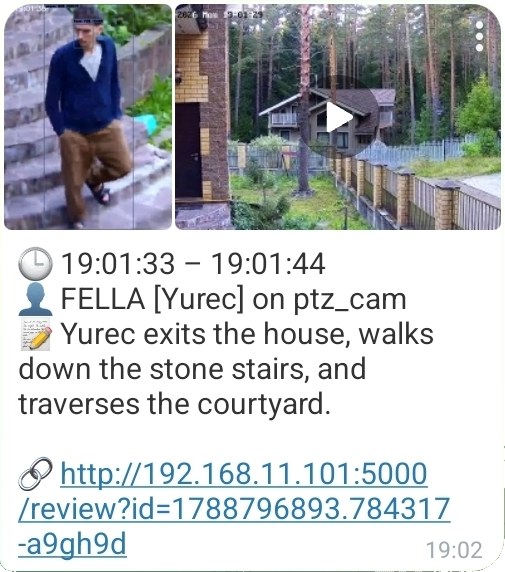
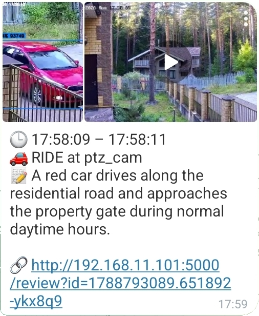
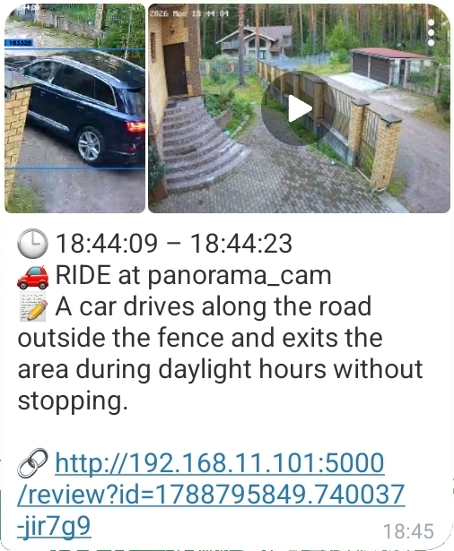

# Frigate Notify Bot

Telegram notifications for [Frigate NVR](https://frigate.video). For every finished event (Frigate *review item*) you get one message with:

- **Annotated snapshots** of every detected object.
- **A video clip of the whole event** — all objects, compressed to fit Telegram limits (hardware encoding on Intel iGPU, CPU otherwise).
- **A caption**: time span, camera, zones, object labels — including sub-labels, recognized faces and license plates when Face Recognition / LPR are enabled in Frigate.
- **AI summary** from Frigate's `review.genai` (`📝 A person walks up to the porch, checks the door and leaves`) with a ⚠️/🚨 marker when Frigate rates the activity as a potential concern.
- **A link** to the review in your Frigate UI.

Delivery channels — enable one or both:

- **Telegram Bot API** — videos up to 50 MB (larger clips are sent without video).
- **Telegram MTProto** (user account) — videos up to 2 GB.

Each channel has its own queue and worker, so a slow upload on one channel never delays the other.

Tested on **Frigate 0.18**.

<p align="center">
  
  
  
</p>

## Quick start

**1. Clone** next to your Frigate `docker-compose.yaml`:

```bash
git clone https://github.com/cocite/frigate_bot.git
```

**2. Configure:**

```bash
cp frigate_bot/config.example.py frigate_bot/config.py
```

Fill in the credentials of the channel you use and enable it in `ENABLED_CHANNELS` — the template explains every field.

**3. Add the service** to your Frigate `docker-compose.yaml`:

```bash
grep -q '^  frigate_bot:' docker-compose.yaml && echo "frigate_bot is already there" || \
sed -n '/^  frigate_bot:/,$p' frigate_bot/docker-compose.example.yaml >> docker-compose.yaml && \
docker compose config --services
```

This appends the block below to the end of the file (works when `services:` is the last top-level section — the usual Frigate layout; otherwise paste it into `services:` by hand) and prints the service list to confirm the file is still valid. The bot reaches `frigate` and `mosquitto` by these service names, so it has to be in the same compose file.

```yaml
  frigate_bot:
    container_name: frigate_bot
    build:
      context: ./frigate_bot
    restart: unless-stopped

    # Uncomment if you have an Intel iGPU — hardware video encoding (VAAPI):
    # environment:
    #   LIBVA_DRIVER_NAME: iHD
    # devices:
    #   - /dev/dri:/dev/dri

    volumes:
      - ./frigate_bot:/app
      - /etc/localtime:/etc/localtime:ro   # host time zone for captions

    depends_on:
      - frigate
      - mosquitto
```

**4. Run:**

```bash
docker compose up -d --build frigate_bot
docker compose logs -f frigate_bot
```

You should see `Subscribed to topics: ['frigate/reviews']`. Walk in front of a camera — the notification arrives when the event ends.

**5. MTProto session** (only for the `TG_MTPROTO` channel):

```bash
docker compose exec -it frigate_bot python tg_client.py
```

It asks for your phone, the code and the 2FA password once. Until the session exists the bot works without MTProto and picks the session up automatically when it appears — no restart needed.

## Configuration

Everything lives in `config.py` (never committed; `config.example.py` is the template).

| Setting | Default | Meaning |
|---|---|---|
| `ENABLED_CHANNELS` | `['TG_BOT']` | delivery channels: `TG_BOT`, `TG_MTPROTO`, or both |
| `TG_BOT_CONFIG` | — | bot token and `chat_id` |
| `TG_MTPROTO_CONFIG` | — | `api_id`, `api_hash`, session name, `chat_id` |
| `FRIGATE_PUBLIC_URL` | `""` | your Frigate UI base URL (`http://192.168.1.10:5000` or `https://frigate.example.com`) — adds a review link at the bottom of the message; empty = no link |
| `PRETTY_LABELS` | `'en'` | object labels in the caption: `'en'` / `'ru'` — emoji + playful name (dictionaries in `pretty_labels.py`, easy to add a language); `None` — raw Frigate labels (`person`, `car`) |
| `GENAI_REVIEW_SHOW` | `True` | add Frigate's AI summary to the caption |
| `GENAI_REVIEW_WAIT` | `25` | how long to wait for the summary, seconds from the start of processing |
| `GENAI_REVIEW_POLL` | `2.0` | summary poll interval, seconds |
| `CLIP_START_SHIFT` / `CLIP_END_SHIFT` | `5` / `5` | video padding before/after the event, seconds |
| `CLIP_MAX_LEN` | `180` | maximum clip length, seconds — chosen so that with the default encoding settings the file fits the Bot API limit (~50 MB) |
| `OUTPUT_WIDTH` / `OUTPUT_FPS` / `OUTPUT_QP` | `1024` / `25` / `26` | encoding parameters |

### AI summaries (Frigate side)

The summary is generated by Frigate itself; the bot only fetches it. Configure it in **Frigate**, not in the bot:

```yaml
genai:
  gemini_cloud:
    provider: gemini            # or openai / ollama / llamacpp
    api_key: "{FRIGATE_GENAI_API_KEY}"
    model: gemini-3.8-flash

review:
  genai:
    enabled: true
    preferred_language: English
    # detections: true          # also summarize detections, not only alerts
```

The bot checks `/api/config` to see whether summaries are enabled and whether they cover the event's severity; if not, it does not wait. Waiting runs in parallel with everything else and is capped by `GENAI_REVIEW_WAIT`, so a slow or missing summary never delays the alert by more than that.

## How it works

```
Frigate ──MQTT frigate/reviews──▶ mqtt_dispatcher ──▶ handle_review
                                                        │  snapshots + clip (Frigate API, in parallel)
                                                        │  ffmpeg: VAAPI / CPU
                                                        │  caption: labels, zones, names, AI summary
                                                        ▼
                                                   notification ──▶ formatter ──▶ queue[TG_BOT]     ──▶ worker ──▶ Bot API
                                                                ──▶ formatter ──▶ queue[TG_MTPROTO] ──▶ worker ──▶ Telethon
```

1. **mqtt_dispatcher.py** subscribes to `frigate/reviews` and hands each message to a worker. Only `type: end` messages are processed — one per finished review item.
2. **handle_review** (`notifier.py`) downloads the annotated snapshot of every detection and the recording clip for the event window (`/api/<camera>/start/<t1>/end/<t2>/clip.mp4`), both in parallel; encodes the clip with ffmpeg (h264_vaapi, or libx264 without a GPU); fetches event details for labels, zones, sub-labels and plates; waits for the GenAI summary (started at the very beginning, in the background); and builds a neutral *notification*: photos, video, caption.
3. **Formatter** (`messenger_style`) turns the notification into channel messages according to the channel's `format_params`: album size, caption limit, video size limit. This is where an oversized video is dropped for the Bot API channel while MTProto still gets it.
4. **Delivery queues**: every enabled channel has its own queue and worker. The worker owns the channel's lifecycle (the MTProto session lives inside the `TG_MTPROTO` worker) and sends messages one by one; a failed message is logged and never blocks the rest.

Adding a channel = a formatter (or reusing `messenger_style` with other params), a transport function and an entry in `CHANNELS`, plus `<NAME>_CONFIG` in `config.py`.

### Files

| File | Role |
|---|---|
| `mqtt_dispatcher.py` | service entry point: MQTT, queues, workers |
| `notifier.py` | event handler, Frigate API, video pipeline, formatter, transports, delivery queues |
| `tg_client.py` | Telethon (MTProto) client and session; `python tg_client.py` creates the session |
| `pretty_labels.py` | emoji and label names per language |
| `log_config.py` | logging setup |
| `config.py` | your settings (from `config.example.py`) |

### Logs

| File | What |
|---|---|
| `frigate_bot.log` | the service (5 MB × 3, rotated) |
| `debug.log` | manual runs: debugging and session creation |

The files always contain everything, including DEBUG; `LOG_LEVEL` in `config.py` only sets what goes to the console (`docker compose logs`).

Every event is logged with its review id, so `grep <review_id> frigate_bot.log` shows its whole path: snapshots, clip, encoding, summary, and delivery per channel.

### Debugging

Run the handler for one event directly, without MQTT — take the payload from the log (`Payload: {...}` lines):

```bash
docker compose exec -it frigate_bot python notifier.py '<json payload>'
```

It uses a separate Telethon session (`*_debug`, created with `python tg_client.py --debug`), so it does not conflict with the running service.

Or replay the last event through the running service:

```bash
./frigate_bot/replay.sh              # last event from the log
./frigate_bot/replay.sh <logfile>    # last event from a specific log
```
